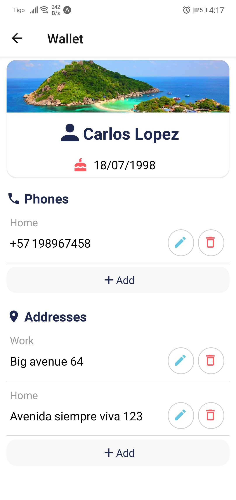
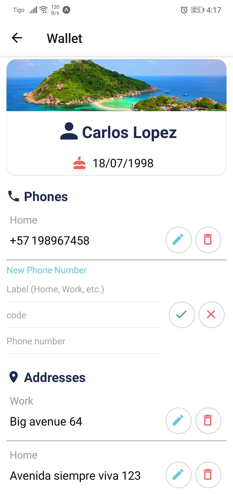
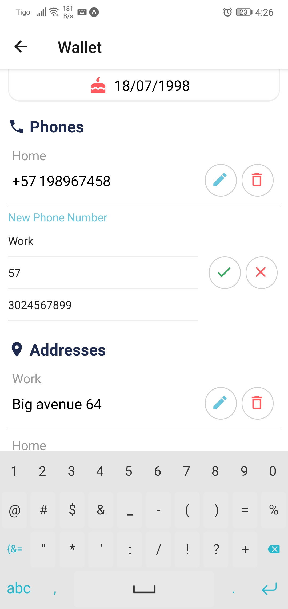
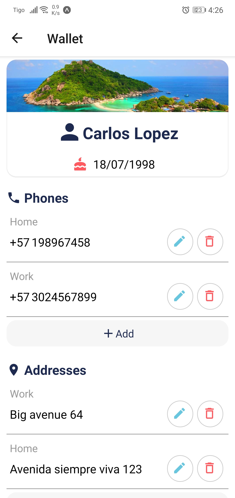
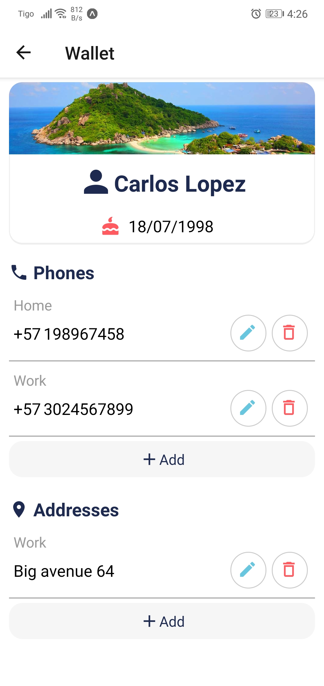
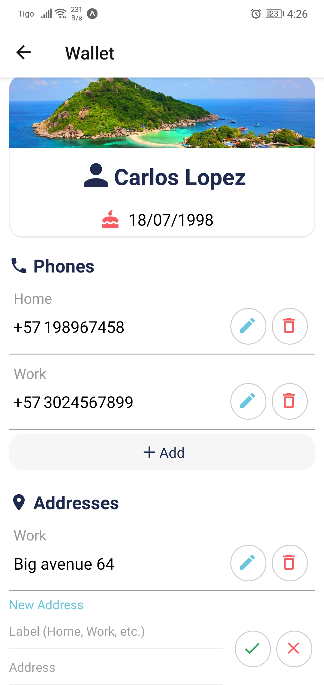
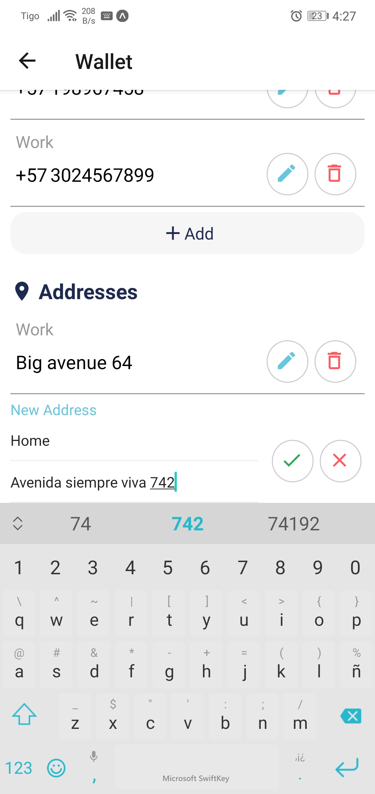
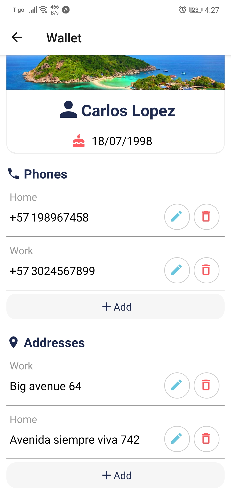

# test_wecontact

Proyecto Front-end

React Native

```
cd app_movil
npm install
npm run start_expo
```

# Capturas

1. Vista de contactos
   
2. Vista de contacto específico
   
3. Añadiendo nuevo teléfono
   
4. Datos para nuevo teléfono
   
5. Se creo el nuevo teléfono
   
6. Borrando dirección
   
7. Añadiendo nuevo dirección
   
8. Datos para nuevo dirección
   
9. Se creo el nuevo dirección
   
